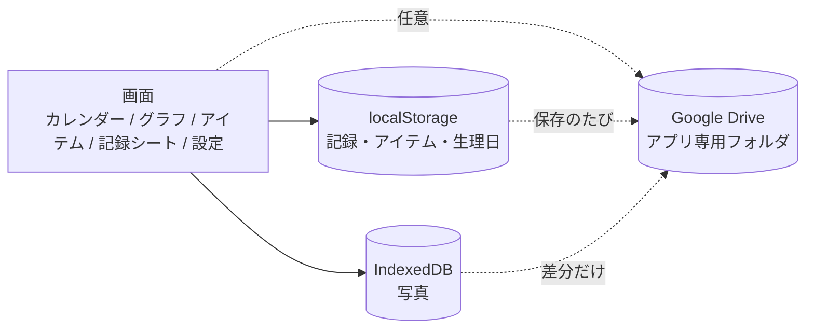
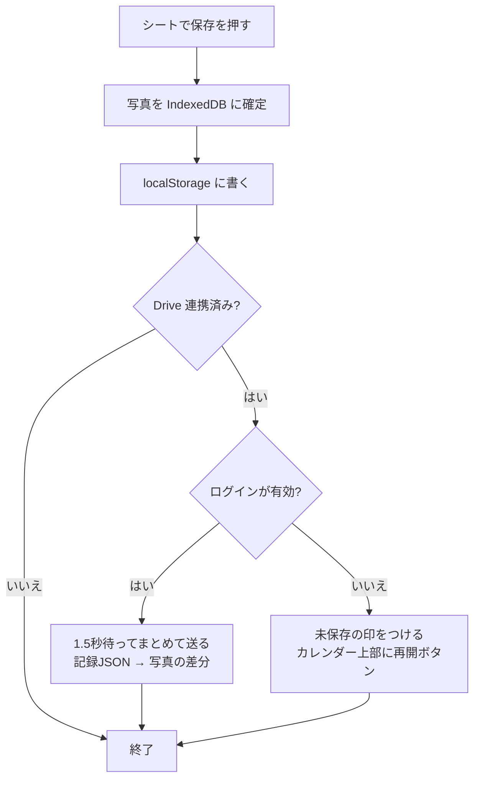

# 肌管理 設計書

`index.html`（1ファイル完結）の作りをまとめたものです。記録項目・画面の使い方は [README](README.md) を見てください。

- 最終更新: 2026-09-21
- 対象: `index.html`（データ形式 `version: 1`）

## 1. 目的と前提

- 肌の状態・スキンケア・生活習慣を毎日記録し、あとから「何をしたとき肌がよかったか」を見返す個人用アプリ
- スマホ中心（幅375pxで崩れないこと）。PCでは幅を中央寄せするだけ
- サーバーを持たない。オフラインでも動く（Google ログインを除く）
- 記録は使っているブラウザの中にある。外に出すのは、本人の Google Drive のアプリ専用フォルダだけ（任意）

## 2. 全体の構成



- 1ファイルの中に HTML・CSS・JS を入れる。フレームワーク・ビルドなし
- グラフは外部ライブラリなしで SVG を手で描く（理由: 1ファイル完結・オフライン動作・折れ線と棒と帯だけで足りる）
- 外部から読み込むのは、書体（Google Fonts）と Google ログインの部品（`accounts.google.com/gsi/client`）だけ。記録そのものを送る先は、本人の Google Drive のアプリ専用フォルダだけ
- スクリプトの並び: 定数 → 時刻の計算 → 保存（localStorage）→ 写真（IndexedDB）→ カメラ → Google Drive → 各画面の描画 → シート → 設定

## 3. 画面

```
[ヘッダー]  今日の日付／設定ボタン（歯車）
[タブバー]  画面の下に固定。カレンダー ｜ グラフ ｜ アイテム
 ├ カレンダー … 月のマス目（肌スコアの色）／今月のまとめ／今日を記録するボタン
 ├ グラフ     … 期間切替（1か月・3か月）／カード（下記）
 └ アイテム   … おすすめ成分／アイテム別の平均スコア／成分別の平均スコア
[記録シート]  日付のマスやボタンから開く。上から順に入力 → 保存
[アイテム編集シート]  商品写真・名前・種類・成分・使っているか
[撮影画面]  顔写真の枠をタップすると開く。インカメ＋顔の枠
[設定]  データ（書き出し／読み込み）／Google Drive／生理周期／表示／全消し
```

グラフのカード:

1. 肌スコア（折れ線）＋睡眠時間（棒）＋生理期間（帯）
2. 寝る・起きる時刻（折れ線。平均とばらつき）
3. 体重（折れ線。記録のある日だけつなぐ）
4. 食事の品目数（棒。7品目以上は濃い色）
5. 食べていない時間（棒。16時間の点線）
6. この期間の内訳（条件ごとの平均スコア）

## 4. データの形

### 4.1 localStorage

| キー | 中身 |
|---|---|
| `skincare_v1` | 記録本体（下のJSON） |
| `skincare_v1_meta` | 端末側の状態。書き出しファイルには入れない（後述） |
| `skincare_v1_broken` | 読めなかった保存データの退避先 |

```js
// skincare_v1
{
  version: 1,
  items: [ { id, name, category, active, ingredients:["ceramide"], photo:"ph_item_it_01" } ],
  ingredients: [ { k:"ceramide", n:"セラミド", genres:["バリア・油分","保湿"], family:"ceramide", icon:"bricks", purpose:"バリア・保湿", for:["乾燥","かゆみ"], avoid:[] } ],  // 成分マスタ（genres=効果ジャンル・複数可、family=成分ファミリー、purpose=ざっくり目的）
  periods: [ { start:"2000-01-01", end:"2000-01-05" } ],                            // 終了が未入力なら end:null
  logs: {
    "2026-09-20": {
      score,            // 1〜5（入れない日は null）
      conditions,       // 状態タグ（配列）
      areaMemo,
      itemIdsAM, itemIdsPM,  // 朝・夜に使ったアイテムのid（配列）
      itemIds,          // その日に使ったアイテム全部（朝・夜・時間帯なしの合計）。平均スコアはこれで数える
      bedTime, wakeTime, sleepHours,   // "HH:MM" / "HH:MM" / 自動計算（旧形式は sleepHours のみ）
      mealStart, mealEnd,              // "HH:MM"。空は null
      water,            // コップの杯数。初期値0
      poop, bath, makeup,              // 選択式。空は null
      foods,            // 10品目の頭文字（配列）
      weight,           // kg。空は null
      avoidFoods,       // 控えたい食べ物（fried/snack/sweet/fast）。null＝未入力、[]＝どれも食べなかった
      supplements,      // 飲んだサプリ（vitc）
      lifeTags, memo,
      photos            // { bare_front:"ph_2026-09-20_bare_front", ... }
    }
  }
}
```

```js
// skincare_v1_meta
{ since, lastExport, driveLinked, driveDirty, lastDrive, noPhotoSync, photoPut:[], photoDel:[] }
```

### 4.2 IndexedDB（写真）

- DB `skincare_photos` ／ store `photos` ／ `{ id, blob }`
- 顔写真のid: `ph_<日付>_bare_<front|left|right>`（1日最大3枚）
  - メイク後の枠（`makeup_*`）は 2026-09-21 に廃止。それより前の記録には残っていることがあり、読み込み時に消さずに残す（画面と写真の枚数には出さない）
- 商品写真のid: `ph_item_<アイテムid>`
- 保存前に長辺800px・JPEG品質0.7に縮める（容量対策）

### 4.3 Google Drive（アプリ専用フォルダ）

- `skincare_v1.json` … `skincare_v1` と同じ中身
- `<写真id>.jpg` … 写真1枚につき1ファイル

### 4.4 決めごと

- 日付キーは `YYYY-MM-DD` の文字列。Date型では持たない（タイムゾーンのズレを避けるため）
- `version` を持つ。読み込み時に `migrate()` で古い形を今の形にそろえる。項目が欠けた記録は既定値で補い、形のちがう値は既定値に戻す（後述の「安全のための作り」）
- 空と0を区別する。体重・写真・メモの「入れなかった日」は `null`
- アイテムは消さない。使わなくなったら `active:false`（過去の記録と平均を壊さないため）
- 睡眠の記録は「起きた日」につける
- 保存は、シートの保存ボタンを押したときだけ。自動保存はしない（入力途中のゴミを残さないため）。例外は生理の開始日・終了日で、押した瞬間に保存する

## 5. 保存と同期



- **写真の確定**: シートの中で追加・削除した写真は、メモリ上の予定（追加＝Blob、削除＝null）として持つ。保存ボタンで初めて IndexedDB に書く。キャンセルなら捨てる
- **Drive へ送るもの**: Drive にない写真、差し替えた写真（`photoPut`）を送り、外した写真（`photoDel`）は Drive からも消す。「写真も Drive に送る」がオフの間は写真を送らない
- **復元**: ログイン → Drive の記録を取得 → 確認 → localStorage に書く → 再読み込み。復元前に必ず確認を出す。**写真はこの時点では取らない**（数が多いと時間がかかるため）
- **写真のオンデマンド取得**: 写真を表示するとき（記録シートの枠、アイテムの写真・一覧のサムネイル）に、端末にない写真だけを Drive から1枚取り、IndexedDB に残す。2回目からは端末から出る。取得中は枠に「取得中」と出す
  - 同時に取る数は4枚まで（`FETCH_PARALLEL`）。Drive への通信は1枚ごとに待ちが入るため、並べて速くする。写真の送信（アップロード）も同じく4枚ずつ
  - ログインが切れていて取れないときは、枠をタップするとログインして取り直す。アイテム一覧では、上に「Drive の写真を表示するには、タップしてログインしてください」を出す
  - 設定の「写真をすべて Drive から取得」で、端末にない写真をまとめて取れる（4枚ずつ、進み具合を表示）
  - ログインの情報は、再読み込みでログインし直さなくて済むよう、そのタブの中（`sessionStorage`）に約1時間だけ覚える。タブを閉じると消える
- **Drive を上書きする前の門番**: 読み込みに失敗しているときは保存しない。端末に記録がないときは専用の確認を出す。置きかえる前に、Drive 側と端末側の日数を並べて見せる
- **ログイン**: Google Identity Services のトークン方式。アクセストークンは約1時間で切れ、自動更新はしない。切れたら「保存が止まっています」を出し、タップで再ログインして続きを送る
- **権限**: `drive.appdata` だけ。アプリ専用フォルダ以外の Drive のファイルは読めない
- **はじめての連携**: Drive に既にファイルがあれば、上書きの確認を出す。勝手に上書きしない
- **バックアップの声かけ**: 最後の書き出し（なければ最初の記録日）から30日たつと、カレンダー上部に出す。日付は `skincare_v1_meta` に持つ（書き出しファイルに入れないため）
- **読めない保存データ**: 上書きせず `skincare_v1_broken` に退避し、その間は保存を止める

## 6. 主な計算

### 6.1 睡眠
- `spanMin(寝た, 起きた)`: 起きた時刻が寝た時刻以前なら、翌日とみなして24時間を足す（23:30→07:00 は 7.5時間）
- 睡眠時間は 0.1時間単位に丸める

### 6.2 食べていない時間
- `fastOf(日)` = 今日の `mealStart` − 前日の `mealEnd`（日をまたぐ）
- 前日の `mealEnd` か今日の `mealStart` が空の日は計算しない
- 目標は16時間（`FAST_GOAL`）。以上なら「達成」と表示

### 6.3 寝る時刻のばらつき
- 夜の時刻は、0時以降も続くように並べ直す（正午より前は +24時間）。23:30 と 0:30 の距離を1時間にするため
- 平均と標準偏差（分）を出す。内訳では「平均の前後30分以内の日」と「外れた日」の平均スコアを比べる

### 6.4 平均スコア
- アイテム別: そのアイテムを使った日の肌スコアの平均
- 成分別: その成分が入ったアイテムを使った日の平均
- 期間の内訳: 条件ごとの平均（7時間以上ねた日、6杯以上の水分、湯船に入った日 など）。時刻の比較（寝た時刻・食べていない時間）は、記録が4日分以上そろったときだけ出す

### 6.5 おすすめ成分
1. 直近14日の記録から、状態タグの出た日数を数える
2. 2日以上出ているものを、多い順に上位3つとる
3. その状態に向く成分（マスタの `for`）を並べる。持っているアイテムに入っていれば強調し、そのアイテム名を出す。なければ「持っていない」
4. 上位に「赤み・かゆみ・乾燥」があるときは、刺激になりやすい成分（`avoid` に含まれるもの。レチノール・AHA・BHA）を取り消し線で出す
5. いちばん下に、「一般的な目安です。ひどい荒れ・痛み・長引く不調があるときは皮膚科で診てもらってください」を必ず出す

診断めいた表示や、「これで治る」という言い方はしない。

### 6.5b 美容成分の判定と、成分・ファミリー・ジャンル
- **☑ 成分あり**: 全成分表示に含まれていれば☑（上位・下位を区別しない）。**★ 主要成分**: ☑のうち、メーカーが商品の特徴として打ち出している成分（本人がつける。複数可）。アイテムには `ingredients`（☑）と `keyIngredients`（★）だけを持つ
- 有効成分かどうか・配合量・成分表の順位は持たない。☑も★も「効果が強い」という意味ではない
- 成分と効果ジャンルは分けて持つ。1つの成分が複数のジャンル（保湿／バリア・油分／透明感・美白／ハリ・エイジングケア／毛穴・肌荒れ／抗酸化）に入ってよい
- 成分ファミリー（レチノール系・ビタミンC系・カンゾウ由来系・ビタミンE系 など）は上位のまとまり。同じファミリーでも別の成分として扱う（パルミチン酸レチノールはレチノールではない、アスコルビン酸はビタミンC誘導体ではない）
- 組み込みの一覧は、読み込みのたびにコードから作り直す。保存データからは、自分で足した成分（`k` が `c_` で始まる）と、一覧から外れたがアイテムが使っている成分だけを引き継ぐ
- アイテムタブの「目的から探す」は、ジャンルごとに、★（主要成分）がそのジャンルに入るアイテムだけを並べる（☑だけでは出さない）。★がないアイテムは「★がまだないアイテム」にまとめる。今後の「肌悩み→手持ちアイテム」推薦は、この ジャンル→アイテム の対応を使う

### 6.6 成分表の貼りつけ
- 全成分表示を「、」「,」「改行」などで1成分ずつに切り、全角半角・大文字小文字・空白・括弧の中身をそろえてから、成分マスタの `match` で照合する。**部分一致はしない**（「パルミチン酸レチノール」を「レチノール」、「ジグリセリン」を「グリセリン」と判定しない）
- 「＜有効成分＞」「その他の成分：」などの見出しは区切りとして読み飛ばす
- 自分で足した成分は、名前そのもので照合する
- 貼りつけた成分表に見つからない☑があれば、確認してから外す。★は残った☑の分だけ引き継ぐ

### 6.7 いいことをした日
- 入力を増やさず、その日の記録から自動で数える（ビタミンCサプリ／控えたい食べ物なし／7品目以上／16時間／水6杯以上／7時間以上睡眠／運動）
- 連続日数は、今日（今日がまだできていなければ昨日）からさかのぼって数える
- カレンダーのマスに ♥、カレンダーの下に項目ごとの連続日数を出す

## 7. 顔写真の撮影

- 枠をタップすると撮影画面が開き、最初にインカメ（`facingMode:'user'`）を使う
- 顔の楕円の枠と、目の高さの破線を重ねる。向きのガイド文を上に出す
- 保存する画像は、画面に見えている範囲をそのまま切り出す（日を変えても、枠との位置関係がそろう）。撮影中の表示は鏡向きだが、保存はふつうの向き
- カメラが使えない・許可されないときは、「写真から選ぶ」で代わりにできる
- カメラは https のページでだけ使える

## 8. デザイン

- 色は `:root` のトークンだけで指定する。ライト・ダークの両方を定義する
- 淡いピンク6色を基本とする。肌スコア1〜5は、この6色のうち5色で表し、記録なしはグレー
- 文字は濃いまま（淡いピンクでは 4.5:1 を満たせないため、文字・線には同じ色相の濃い版を使う）
- Apple のヒューマンインターフェイスガイドラインに沿う
  - タップ領域は44pt以上、押した状態を必ず出す
  - 本文17px、補助の文字も11pxを下回らない
  - 画面の切り替えは下のタブバー（アイコン＋ラベル）
  - シートは左上＝キャンセル／右上＝保存
  - セーフエリアを避ける、動きを減らす設定を尊重する、VoiceOver 用の説明を付ける
- 書体は Noto Sans JP（数値は Inter）。日本語の見やすさを優先し、システムフォントからは外れている

## 9. 制約・注意

- 記録は、使ったブラウザにしか残らない。ブラウザのデータを消すと消える
- iOS の Safari は、しばらく使わないサイトのデータを消すことがある。バックアップを取ること
- プライベートブラウズでは、保存や写真が使えない場合がある
- JSON書き出しには写真が入らない。写真のバックアップは Google Drive 側で行う
- Google ログインは、公開状態が「テスト」の間、許可が約7日で切れる。個人利用なので、この状態のままにしている
- 画面の文言は日本語のみ

## 10. 安全のための作り

顔写真と体調の記録を持つので、次の作りにしている（2026-09-21 にセキュリティ観点で見直した）。

- **公開先はこのアプリ専用のドメイン**。localStorage と IndexedDB は URL（origin）ごとに分かれる。同じドメインに別のサイトを置くと、そちらから記録・写真を読めてしまうため、ほかのページは置かない
- **画面に出す前に無害化する**（`esc()`）。JSON読み込みや Drive 復元で入ってきた文字を、HTMLとして解釈させない
- **読み込んだデータの形を確かめる**（`migrate()`）。日付の形をしたキーだけを通し、スコアは1〜5（欠けていたり形がちがえば空にする）、時刻は `HH:MM`、配列は中身も文字列だけに絞る。形のちがう値は既定値に戻すので、壊れたデータを読んでも画面が落ちない
- **Drive を空の内容で上書きしない**（上の「門番」）
- **全消しは端末の中身をまとめて消す**。記録・アイテム・生理日に加えて、写真（IndexedDB）・`skincare_v1_meta`・`skincare_v1_broken` も消す。Drive 側は消さないので、その旨を確認画面に出す
- **アクセストークンは保存しない**。メモリにだけ置き、書き出しJSONにも入れない。権限は `drive.appdata` だけ

## 11. 今後の候補

- カレンダーから写真を見る／同じ角度で日付を並べて見比べる画面
- 肌スコアと生活習慣の相関を自動でコメントする機能
- おすすめ成分を、スコアが低い日に出ている状態で重みづけする（いまは出た日数だけで決めている）
- JSON書き出しに写真を含める
- CSP（外部通信の許可リスト）を入れる。`connect-src` を絞れば、記録が外に出ないことをブラウザ側でも守らせられる
- カメラの許可待ち中にキャンセルしたとき、そのあと許可が下りるとカメラが止まらない（未修正）
